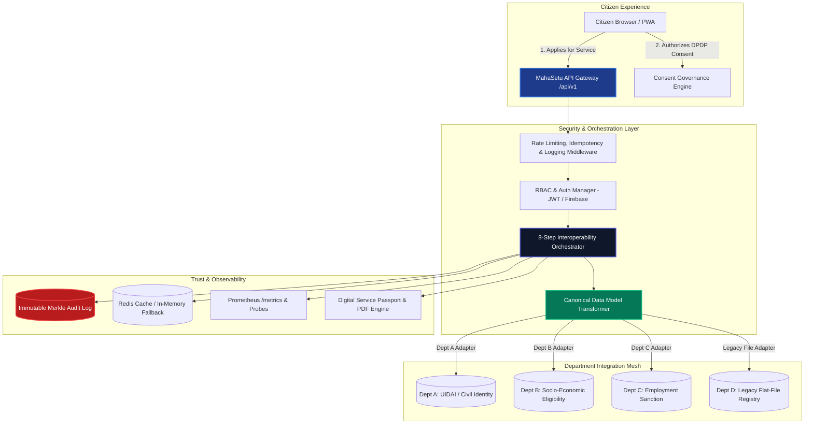

# MAHASETU 🇮🇳

### Government Interoperability & Verifiable Digital Service Passport Platform
**Addressing Government of Maharashtra Problem Statement 26129**

> **ONE CITIZEN. ONE CONSENT. ONE APPLICATION ID. MULTIPLE DEPARTMENTS. ONE UNIFIED SERVICE JOURNEY.**  
> *Existing government systems remain in place. MahaSetu securely connects them.*

---

## 🏛️ Context & Problem Statement

Government of Maharashtra **Problem Statement 26129**:
*System integration and interoperability among government digital platforms, resulting in fragmented service delivery.*

Departments independently maintain distinct portals, databases, registries, and approval pipelines. Because of disparate data formats, citizens must submit identical documentation repeatedly, track multiple disjointed applications, and make physical visits. Administrators lack unified visibility into citizen outcomes, bottlenecks, and cross-departmental SLAs.

**MahaSetu** acts as the secure, federated interoperability middleware layer providing:
- **Canonical Data Model (CDM) Transformations** for heterogeneous REST APIs and legacy pipe-delimited schemas.
- **DPDP Act 2023 Compliant Consent Management** with tamper-evident cryptographic hashes.
- **Universal Service Tracking** with a single permanent identifier (`MH-APP-2026-XXXXXX`).
- **Verifiable Digital Service Passports** with downloadable PDF receipts and QR public verification.
- **Observability & Ops Readiness**: Prometheus `/metrics`, Kubernetes probes (`/healthz`, `/readyz`), structured JSON correlation logging (`X-Request-ID`), and disaster recovery backups.
- **Bilingual Interface**: Full English and Marathi (`मराठी`) localization with WCAG 2.1 AA accessibility.

---

## 🏗️ End-to-End Interoperability Architecture



---

## ⚡ Quick Start Guide

### Prerequisites
- Python 3.11+ (Python 3.12 or 3.14 verified)
- Node.js 20 LTS or 22+
- Docker & Docker Compose (optional)

### 1. Local Development (Instant Zero-Dependency Boot)

```bash
# Clone the repository
git clone https://github.com/Vinzz006/MAHASETU-Web.git
cd MAHASETU-Web

# Configure backend environment
cp .env.example .env

# Set up Python virtual environment
python -m venv venv
# Linux / macOS:
source venv/bin/activate
# Windows PowerShell:
.\venv\Scripts\Activate.ps1

# Install backend dependencies
pip install -r backend/requirements.txt

# Apply database schema migrations
alembic upgrade head

# Start FastAPI backend (runs on http://127.0.0.1:8000)
uvicorn backend.app.main:app --reload --port 8000
```

In a second terminal window:
```bash
# Configure and launch frontend
cd frontend
npm install
npm run dev
# Frontend runs on http://localhost:5173
```

### 2. Docker Compose (Full Stack with PostgreSQL)

```bash
docker compose up --build
```
- Frontend UI: `http://localhost:5173`
- Backend Swagger OpenAPI: `http://localhost:8000/docs`
- Cloud Health Probes: `http://localhost:8000/healthz` and `http://localhost:8000/readyz`
- Prometheus Metrics: `http://localhost:8000/metrics`

---

## 👥 Demo Personas & Credentials

All test personas are pre-seeded and accessible via 1-click switcher in the navigation bar:

| Persona | Role | Username / Mobile | Password | Purpose |
| :--- | :--- | :--- | :--- | :--- |
| **Demo Citizen** | `CITIZEN` | `9999999999` | `mahasetu123` | Submit applications, grant DPDP consent, view disclosure log, download PDF receipt |
| **Officer Sharma** | `OFFICER` | `8888888888` | `mahasetu123` | Real-time SLA monitoring, resolve integration exceptions, CSV export |
| **System Admin** | `SYSTEM_ADMIN` | `7777777777` | `mahasetu123` | AI Schema Mapping approvals, batch citizen registration approval |
| **Auditor Kulkarni** | `AUDITOR` | `6666666666` | `mahasetu123` | Cryptographic Merkle compliance audits and tamper-proof verification |
| **Dept A Officer** | `DEPARTMENT_A` | `5555555551` | `mahasetu123` | Identity verification transaction processing |
| **Dept B Officer** | `DEPARTMENT_B` | `5555555552` | `mahasetu123` | Eligibility assessment and socioeconomic rule evaluation |
| **Dept C Officer** | `DEPARTMENT_C` | `5555555553` | `mahasetu123` | Final scheme sanctioning and DBT benefit award |

---

## 🗄️ Database Migrations (Alembic)

Database schema evolution is strictly tracked and managed with **Alembic**:

```bash
# View migration history
alembic history

# Upgrade to the latest revision
alembic upgrade head

# Rollback one revision
alembic downgrade -1

# Create a new auto-generated migration
alembic revision --autogenerate -m "add_new_feature_table"
```

---

## 🛡️ Observability & Operations

- **Cloud Probes**:
  - `GET /healthz`: Kubernetes liveness probe.
  - `GET /readyz`: Readiness probe verifying database, auth, and AI model connectivity.
- **Prometheus Metrics**:
  - `GET /metrics`: Standard RFC Prometheus exposition format tracking request rates, HTTP duration latencies, cache hit/miss ratio, and departmental throughput.
- **Disaster Recovery Scripts**:
  - Bash: `backend/scripts/backup_restore.sh {backup|restore <file>|verify <file>}`
  - PowerShell: `backend\scripts\backup_restore.ps1 -Action backup`
  - Automated SHA-256 checksum generation and validation for backup integrity.
- **Structured JSON Logging**: Every request is tagged with an immutable `X-Request-ID` correlation header tracked across all system logs.
- **Feature Flags**: Evaluated at `GET /api/v1/platform/features` with dynamic runtime overrides.

---

## 🧪 Comprehensive Automated Testing

MahaSetu maintains automated test suites across both backend and frontend:

### Backend Test Suite (Pytest)
```bash
# Run all 161+ backend tests
python -m pytest backend/tests

# Run with verbose output
python -m pytest backend/tests -v
```

### Frontend Test Suite (Vitest & TypeScript)
```bash
cd frontend

# Run frontend tests
npm test -- --run

# Compile TypeScript and build production bundle
npm run build
```

---

## 🔒 Security Posture & Compliance

- **DPDP Act 2023 Compliant**: Explicit citizen consent required prior to any cross-departmental data transfer; citizens can inspect all historical disclosures via `/citizen/consent-history`.
- **Cryptographic Merkle Proofs**: SHA-256 audit logs guarantee non-repudiation for administrative actions.
- **Role-Based Access Control (RBAC)**: Enforced via cryptographic JWTs and FastAPI dependency guards.
- **OWASP API Security**: Sliding-window rate limiting, 24-hour idempotency caching, and unified error envelopes.

---

## 📄 License & Attribution

Developed for the **Government of Maharashtra Hackathon (Problem Statement 26129)**.  
Licensed under the [MIT License](LICENSE).
